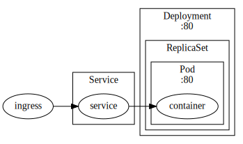
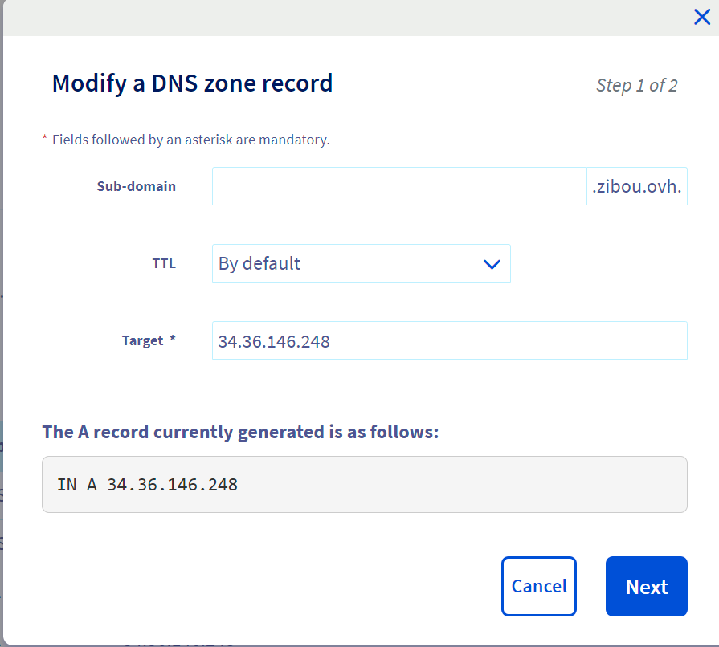

Four years have passed since my last blog post, and during that time, my interests in technology have evolved, steering me towards DevOps and automation practices. With newfound free time, I decided to embark on a side project that would allow me to apply my recent knowledge in the field of DevOps. This led me to a compelling idea: why not treat my blog as a service and leverage DevOps practices to deploy it on Google Cloud Platform (GCP)?

Here are the technical requirements I set for this project:

- Containerization: I aimed to encapsulate my Hugo website within a Docker image, equipped with an Nginx server to serve the static content.

- Kubernetes Deployment: The Docker container would be orchestrated as a deployment within a Kubernetes Cluster (K8s), accessible from a domain name with HTTPS protocol

In addition to the technical aspects, I also integrated DevOps best practices into my project:

- Git-Based Management: All the code of the blog, k8s cluster..., would be version-controlled using Git.
- CI/CD Pipeline: My CI/CD (Continuous Integration/Continuous Deployment) pipeline would be configured to automatically deploy the infrastructure and the blog whenever there is a commit to the main branch.

While these requirements already posed a significant challenge, I decided to forgo the complexity of multi-environment deployment, focusing on the initial development stages of the project. 


# Hugo and container

[Hugo](https://gohugo.io/) is a fast static website generator framework written in Go, allowing me to effortlessly transform markdown content into a visually stunning blog with code formatted. 

To summarize the process of building a static website using Go and Hugo:

- Select and download a suitable template
- Write blog posts in markdown
- Utilize `hugo server` to test and validate the result
- Execute `hugo` to generate the final webpage, which can be found in the `public` folder

Now, the next step in this journey involves creating a Dockerfile to construct an image. This involves defining two distinct stages:

- *Build Stage*: In this stage, we'll install Hugo and build the website using it. This step ensures that the necessary assets are generated.

- *Final Stage*: Starting from a base Nginx image, we'll copy the assets to the serving folder. 
The final image does not need the hugo binary or the markdown files.
This separeted two phases is crucial for optimizing the final image, including only the essential files required. 
```docker
# Stage 1
FROM alpine:latest AS build

# Install the Hugo go app.
RUN apk add --update hugo

WORKDIR /blog

# Copy Hugo config into the container Workdir.
COPY . .

# Run Hugo in the Workdir to generate HTML.
RUN hugo 

# Stage 2
FROM nginx:1.25-alpine

# Set workdir to the NGINX default dir.
WORKDIR /usr/share/nginx/html

# Copy HTML from previous build into the Workdir.
COPY --from=build /blog/public .

# Expose port 80
EXPOSE 80/tcp
```

Once the Dockerfile is saved. I can go the directory that contains the Dockerfile and create the image locally with
```
docker build . -t namnguyen107/blog
```
This command build the image and give it the name `blog`. Now I can run the image with the command

```
docker run -d -p 5000:80 --name blog namnguyen107/blog
```

This command run the image `blog` in the background (`-d`), exposes the port `80` to the local machine port `5000` and names the container `blog`

Now the image is built succesfully, I can now publish my image in order to be tested in the next step.
```
docker image push namnguyen107/blog
```
In the next section, I will show details about how I build my k8s cluster and run this docker image inside it.


# K8s definitions

This is roughly what I want to have in the cluster k8s.


My goal is not to explain all the k8s components in detail, but to briefly describe what is used in this project.

The container at the botton of the diagram runs the image docker. The container runs a nginx process that exposes the port 80 inside a Pod. A Pod can contain more than one container. But in this case there is only one.

The Pod is managed by a [ReplicaSet](https://kubernetes.io/docs/concepts/workloads/controllers/replicaset/), a component that guarantees the availability of a specified number of identical Pods.

The `ReplicaSet` is managed by the `Deployment` component, that adds the rollout and rollback features. You don't see the definition of the `ReplicaSet` because it's incorporated in `Deployment` component.

We need the `Deployment` service because `Pod` is ephemeral, it can crash, or when we deploy some new image version the old pod is destroyed and replaced by a new one. The `Deployment` component maintains the desired state of a group of `Pod`.

We also need a `Service` component to provide a stable networking for Pods and exposes the port for external access. The Service type is `NodePort` that provides access from outside the cluster by using any node's IP address and the node port (80).

This is the definition of the `Deployment` resource:

```yaml
apiVersion: apps/v1
kind: Deployment
metadata:
  name: blog-deployment
spec:
  selector:
    matchLabels:
      app: blog
  replicas: 1 # tells deployment to run 1 pods matching the template
  template:
    metadata:
      labels:
        app: blog
    spec:
      containers:
        - name: blog
          image: namnguyen107/blog # the name if the image that we pushed to docker hub earlier
          imagePullPolicy: Always
          ports:
            - containerPort: 80
```

And this is the definition of the `Service`:

```yaml
apiVersion: v1
kind: Service
metadata:
  name: blog
spec:
  type: NodePort
  ports:
    - port: 80
      protocol: TCP
      targetPort: 80
  selector:
    app: blog
```

At the end of this step, I can deploy all these resources with
`kubectl apply .`
The pods are available:
```
NAME                               READY   STATUS    RESTARTS   AGE
blog-deployment-7dd6765d9c-hn987   1/1     Running   0          53m
```
And I can use port forwarding feature to access the blog from my local machine.
```
kubectl port-forward blog-deployment-7dd6765d9c-hn987 8080:80
```
And see that everything works!
But the blog is exposed only from inside the cluster, I will need to exposes to a Domain Name with https (optional) for public access.

# Domain name, DNS, Ingress and HTTPS certificate
## Domaine name
In order to get a public website, the first obvious task is to buy the domain name, because I don't want you to type the address IP `34.36.146.248` that is hard to memorize and can be changed overtime.

For a personal project, I don't want to spend much for the domain name. That's why I've found very cheap domain name on OVH.

Once the domain name is available, I can't do anything interesting much for now, because the domain name must be mapped to a public address in my GCP project which I don't have.

That's why I should create an IP address.

## Stable IP address.

I reserve the IP address by this command:
```
gcloud compute addresses create zibou-ip \
  --global \
  --ip-version IPV4
```
Note that this task will be automated in the future. For the moment I try to make everything work manually, but carrefully take note of every command/step made.

## Ingress and certificate

Just a quick reminder, our k8s provides currently the `NodePort` service  that does not expose our blog to the public internet. To accomplish this goal, 
I will create an `Ingress` service that uses the IP address reserved beforehand.

If I did not reserve a stable IP beforehand, the `Ingress` component can create a new one. But in this case, the IP address is not stable and can be replaced if I recreated the cluster.

As I mentionned ealier, I want to use the protocol HTTPS for my blog, even through it's not necessary for now, because there is no user data transfer between the user and the server. It's a static website after all. But the whole point of this project is for learning and experimenting. 
And we must provide a certificate accepted by the browser in order to establish a secured connection.

This is a very informative [video](https://www.youtube.com/watch?v=j9QmMEWmcfo) that explains how the HTTPS protocol works and the role of the certificate. But what is not said in this video is how to obtain the certificate and how the authority knows that I am the owner of the domain and I have the private key. This is a document from [Let's encrypt](https://letsencrypt.org/how-it-works/) that explains well how `letsencrypt` achieve this task.

I did try Let's Encrpyt first and encountered some difficulties, then found out that Google provides a [managed certificate](https://cloud.google.com/kubernetes-engine/docs/how-to/managed-certs) and here's the exact definition of the certificate I've used:

```
apiVersion: networking.gke.io/v1
kind: ManagedCertificate
metadata:
  name: zibou-cert
spec:
  domains:
    - zibou.ovh
```


And this is the definition of the `Ingress` component

```
apiVersion: networking.gke.io/v1beta1
kind: FrontendConfig
metadata:
  name: zibou-frontend-config
spec:
  redirectToHttps:
    enabled: true
    responseCodeName: MOVED_PERMANENTLY_DEFAULT
---
apiVersion: networking.k8s.io/v1
kind: Ingress
metadata:
  name: zibou
  annotations:
    networking.gke.io/managed-certificates: zibou-cert
    # This tells Google Cloud to create an External Load Balancer to realize this Ingress
    spec.ingressClassName: gce
    # This enables HTTP connections from Internet clients
    kubernetes.io/ingress.allow-http: "true"
    # This tells Google Cloud to associate the External Load Balancer with the static IP which we created earlier
    kubernetes.io/ingress.global-static-ip-name: zibou-ip
    networking.gke.io/v1beta1.FrontendConfig: "zibou-frontend-config"
spec:
  defaultBackend:
    service:
      name: blog
      port:
        number: 80
```

* The annotation `networking.gke.io/managed-certificates` points to the name of the certificate defined above (`zibou-cert`)
* The annotation `kubernetes.io/ingress.global-static-ip-name` points to the name of the stable address ip created above (`zibou-ip`)
* The backend is where the traffic will be routed to, is defined by tag `name` with value `blog` and will use the port 80 of this backend.

The Ingress controller will create a managed Load Balancer and route the traffic from the stable address IP to the `Pod` inside the Cluster.

Now it does not work yet, we must map the DNS record to the stable IP address. First get the value of the address by this command:

```
$ gcloud compute addresses list
NAME: zibou-ip
ADDRESS/RANGE: 34.36.146.248
TYPE: EXTERNAL
PURPOSE:
NETWORK:
REGION:
SUBNET:
STATUS: IN_USE
```
The last step is to create/edit the record with the good IP address


The mapping process takes several hours. The process of signing the certificate takes place at the same time, because when the certificate is created,
GCP continously request the domain name `zibou.ovh` to verify that there is a routing between the domain name and the address IP.

Now I am so satisfy that the most important part of this project is over. But it's still far from finished.